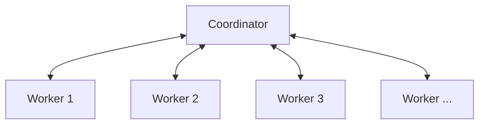

# Airtruct - Powerful ETL tool in a single file

> ETL Pipelines, Made Simple — scale as you need, without the hassle.

[]() []()

Airtruct is a modern, open-source data pipeline tool designed to be a powerful and efficient alternative to tools like Airbyte and Fivetran. It empowers data analysts and scientists to easily build and manage data streams with a user-friendly, DAG-style UI.

## Key Features

- **Visual DAG-style Stream Builder:** Intuitive UI to visually create and manage data pipelines using a Directed Acyclic Graph (DAG) interface.
- **Powerful In-Pipeline Transformations:** Utilize Bloblang, a lightweight, JSON-like DSL, for efficient data transformation and enrichment within the pipeline. Bloblang offers built-in mapping, filtering, and conditional logic, often replacing the need for separate transformation tools like dbt.
- **Flexible Subprocess Processor:** Integrate processors or enrichers developed in any programming language. Communication occurs via stdin/stdout, ensuring language-agnostic compatibility.
- **Native HTTP Input:** Accept data over HTTP, making it ideal for handling webhooks and streaming data sources.
- **Horizontally Scalable Worker Pool Architecture:** Scale your data processing capabilities with a horizontally scalable worker pool.
- **Delivery Guarantee:** Ensures reliable data delivery.
- **Buffering and Caching:** Optimizes performance through buffering and caching mechanisms.
- **Robust Error Handling:** Provides comprehensive error handling capabilities.

## Why Airtruct?

Airtruct stands out from traditional ETL tools through its **completely free Apache 2.0 license** and **zero operational overhead**. Unlike Docker-heavy alternatives that require complex setups, Airtruct runs as a single lightweight binary with no dependencies. It features **native transformation capabilities** using the powerful Bloblang DSL, eliminating the need for separate tools like dbt, while supporting **custom processors in any programming language** through simple stdin/stdout communication. With built-in HTTP input support for webhooks, a full **DAG-style visual interface**, and comprehensive observability (metrics, tracing, and logs), Airtruct delivers enterprise-grade functionality without the enterprise complexity. Its horizontally scalable worker pool architecture ensures you can handle massive workloads while maintaining the simplicity that makes data engineering enjoyable again.

## Architecture

Airtruct employs a Coordinator & Worker model:

- **Coordinator:** Handles pipeline orchestration and workload balancing across workers.
- **Workers:** Stateless processing units that auto-scale to meet processing demands.

This architecture is lightweight and modular, with no Docker dependency, enabling easy deployment on various platforms, including Kubernetes, bare-metal servers, and virtual machines.



## Performance & Scalability

Airtruct is designed for high performance and scalability:

- **Go-native:** Built as a single binary with no VM or container overhead, keeping things light and fast.
- **Memory-safe and Low CPU Usage:** Engineered for efficient resource utilization.
- **Smart Load Balancing:** Worker pool model with intelligent load balancing.
- **Parallel Execution Control:** Fine-grained control over parallel processing threads.
- **Real-time & Batch Friendly:** Supports both real-time and batch data processing.

## Quick Start

### 📦 1. Download the Latest Binary

You can get started with **AirTruct** quickly by downloading the precompiled binary:

- Go to the [Releases page](https://github.com/sananguliyev/airtruct/releases).
- Find the latest release.
- Download the appropriate binary for your operating system (Windows, macOS, or Linux).

After downloading and extractict binary:

- **On Linux/macOS**: make the binary executable:
```bash
chmod +x [airtruct-binary-path]
```
- **On Windows**: just run the .exe file directly.

### ⚙️ 2. Set up SQLite or other full database URI
If you want to quickly start with SQLite as your database, set the DATABASE_URI environment variable before running the coordinator otherwise Airtruct will store data in memory and you will lose the data after process stopped:
```bash
export DATABASE_URI="file:./airtruct.sqlite?_foreign_keys=1&mode=rwc"
```

### 🚀 3. Run coordinator & worker
Start the AirTruct coordinator by specifying the role and gRPC port:
 - optionatlly you can specify `-http-port` if you want to run console different port that `8080`
```bash
[airtruct-binary-path] -role coordinator -grpc-port 50000
```

Now run the worker with same command but role `worker` (if you are running both on the same host consider using different GRPC port).
```bash
[airtruct-binary-path] -role worker -grpc-port 50001
```

You're all set, just open the console http://localhost:8080 — happy building with AirTruct! 🎉

## Example: Kafka to PostgreSQL Pipeline

Want to see Airtruct in action? Check out our comprehensive [Kafka to PostgreSQL streaming example](examples/kafka-to-psql/) that demonstrates a complete end-to-end pipeline. This tutorial shows you how to stream events from Kafka through Avro schema registry processing directly into PostgreSQL, showcasing Airtruct's real-time processing capabilities and easy configuration.
  
## Documentation

Documentation is currently in progress.  
Feel free to open [issues](https://github.com/sananguliyev/airtruct/issues) if you have specific questions!

## Contributing

We welcome contributions! Please check out [CONTRIBUTING](CONTRIBUTING) (coming soon) for guidelines.

## License

This project is licensed under the Apache 2.0 License. See the [LICENSE](LICENSE) file for details.
