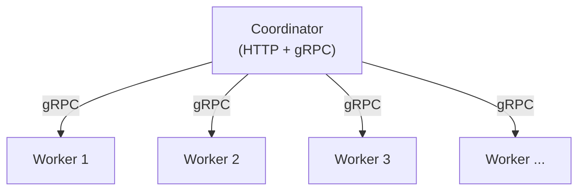

# Architecture

Airtruct uses a **Coordinator & Worker** model designed for simplicity and horizontal scalability.

## Overview

## Coordinator

The coordinator is the control plane. It:

- Serves the **web UI** and **REST API** on the HTTP port (default `8080`).
- Manages **stream definitions** — create, update, delete, start, stop.
- Handles **worker registration** and health tracking via gRPC.
- Balances **workload distribution** across available workers.
- Stores all state in the configured database (SQLite or PostgreSQL).
- Exposes an **MCP server** at `/mcp` endpoint using Streamable HTTP transport, allowing AI assistants to discover and call streams configured as MCP Tools.

There is one coordinator per deployment.

## Workers

Workers are the data plane. They:

- **Register** with the coordinator on startup via gRPC.
- **Execute streams** — run the actual input, processing, and output pipelines.
- Are **stateless** — all configuration comes from the coordinator.
- Can be **added or removed** at any time for horizontal scaling.
- Send periodic **heartbeats** to the coordinator.

You can run as many workers as needed. Each worker handles one or more streams assigned by the coordinator.

## Communication

All communication between coordinator and workers uses **gRPC**. The coordinator exposes a REST/HTTP API (with gRPC-Gateway) for the web UI and external integrations.

### MCP Server

The coordinator includes a built-in **Model Context Protocol (MCP) server** that exposes streams as tools for AI assistants. This server:

- Is accessible at the `/mcp` endpoint on the coordinator's HTTP port
- Uses the **Streamable HTTP transport** protocol from the MCP specification
- Automatically syncs tools every 5 seconds based on active streams with the MCP Tool input
- Works with any MCP-compatible client (Claude Desktop, Claude Code, Cursor, etc.)
- Forwards tool calls to workers for execution and returns the response

When an AI assistant calls a tool, the MCP server:
1. Receives the tool call via the `/mcp` endpoint
2. Forwards the request to a worker running the corresponding stream
3. The stream processes the request through its processors
4. Returns the result with optional status code (via `meta status_code`) to the AI client

See the [MCP Tool component](/docs/components/inputs/mcp-tool) and [MCP Tool Integration guide](/docs/guides/mcp-tool) for details on creating and connecting MCP tools.

## Deployment

Since Airtruct is a single binary, deployment is straightforward:

- **Single machine**: Run coordinator and worker(s) as separate processes with different gRPC ports.
- **Multiple machines**: Run the coordinator on one host and workers on others, pointing workers to the coordinator's address via `-discovery-uri`.
- **Kubernetes**: Deploy coordinator as a Deployment/Service and workers as a **StatefulSet**. StatefulSets give each worker pod a stable hostname (e.g., `airtruct-worker-0`, `airtruct-worker-1`), which prevents stale worker registrations that occur with Deployments where pods get random names on every restart.
- **Docker Compose**: Use the included `docker-compose.yml` for local development.

No Docker, JVM, or external dependencies are required.
